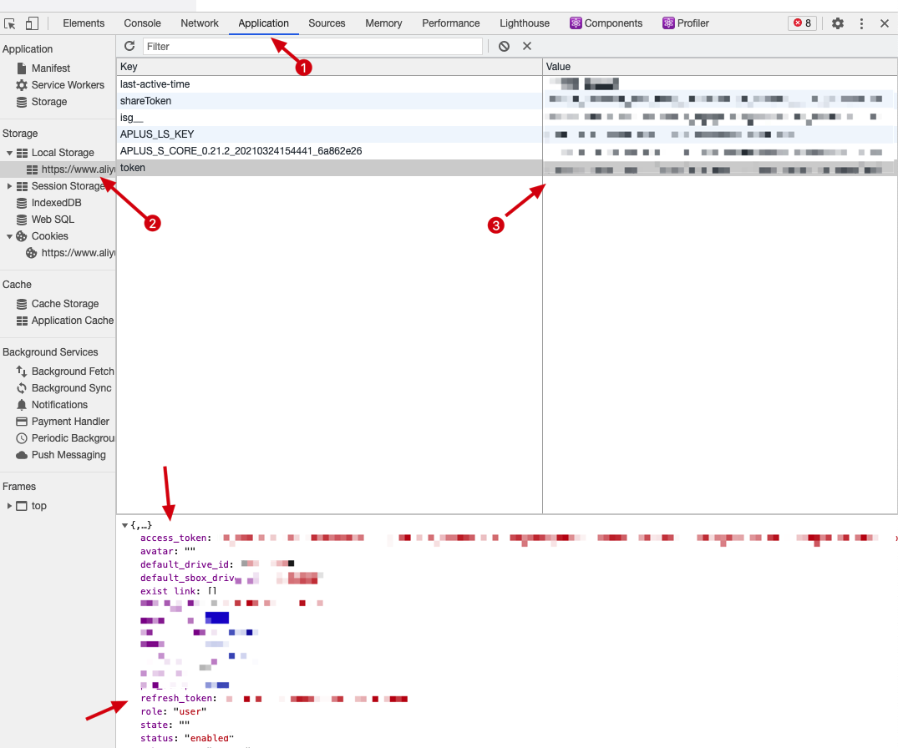

# 阿里网盘API

阿里网盘API的Python实现，本项目目前没有实现登录的接口，因此需要用户自行登录之后获取登录凭证。

# 环境配置

- python>=3.6

我仅仅在Mac上测试过, 还没有在Win上面进行尝试, 有问题欢迎大家提Issue，在我的能力范围之内尽力解决。

# 使用说明

## 安装方法

```shell
git clone https://github.com/Litt1eQ/aliyundrive-api.git
cd aliyundrive-api
pip install -r requirements.txt
```

## 配置文件

在项目根目录创建`config.ini`文件，内容如下:

```ini
[account]
access_token = AccessToken
refresh_token = RefreshToken
drive_id = YourDriveId
```

参数获取

右键打开审查元素，然后找到Application -> Local Storage



注意，拥有access_token和refresh_token就可以控制整个网盘，大家一定**不要把这个泄露出去**，**一定不要泄露**!!!!

重要事情多说几遍,记住上面的内容

`drive_id`可以不填写，默认会取`default_drive_id`并更新配置文件，目前这个的作用我没发现(也有可能有隐藏彩蛋，我不知道)。

## 使用方法

```shell
python index.py file_path [parent_name]

# 例子:
# python index.py ./test_upload_folders x/y
```

- file_path: 需要上传的文件/文件夹的路径
- parent_name: 上传到网盘的目录路径，如果不填默认上传到root, 支持/分割子目录

## 其他使用说明

代码写的可能不是很完善，如果有bug, 欢迎提交issue或pr, 如有其它需要改动的，自己动手改改吧，代码不多，也不难。(逃)

# 引入的第三方库

- requests: https://github.com/psf/requests
- tqdm: https://github.com/tqdm/tqdm

# 声明

> 如有侵权, 联系删除
>
> 本项目仅供研究学习使用，请勿将本项目用于非法用途，违反者后果自负
